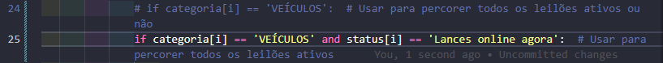

# ETL - Leilão veícular
## Extração, Transofrmação e Apresentação de dados Extraídos do site: [Parque dos Leilões](https://www.parquedosleiloes.com.br/)
Projeto para extração de dados de leilão de veículos. NOS VALORES FINAIS NÃO FORAM CALCULADAS AS TAXAS DO LEILÃO.

## Para rodar o web scraping
## AJUSTE IMPORTANTE NO SCRAPY


```bash
scrapy crawl parque_leiloes -O ../../data/data.json
```

Para rodar a transformação do arquivo .json em sql

```bash
python3 transformacao/main.py
```

Para rodar o framework DASH tem que fazer isso dentro da pasta SRC

```bash
python3 dashboard/app.py 
```
